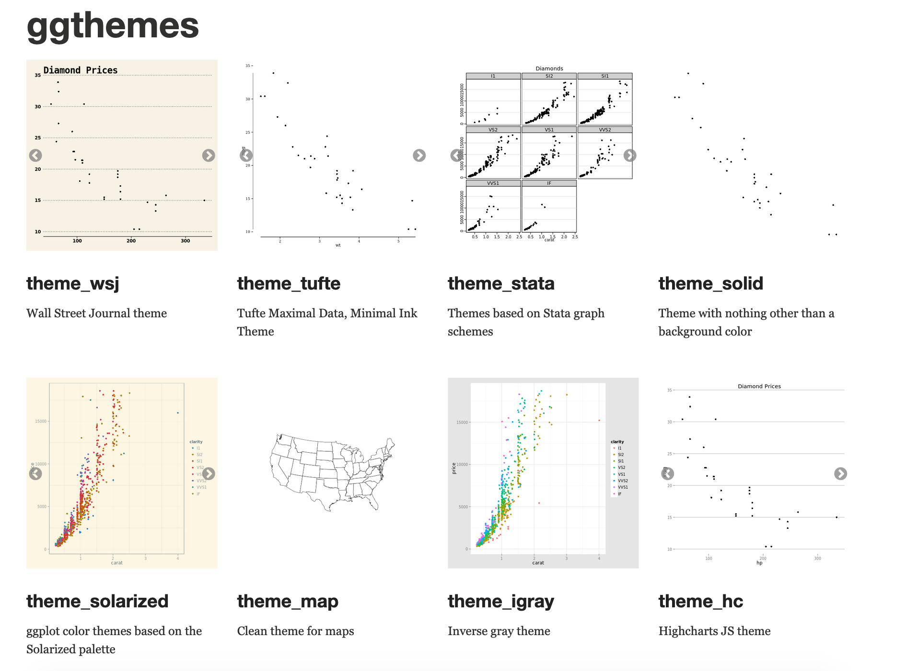

```{r setup, include=FALSE}
knitr::opts_chunk$set(warning = FALSE, message = FALSE, 
                      fig.retina = 3, fig.align = "center")
```

```{r packages-data, include=FALSE}
library(tidyverse)
library(gapminder)
library(countdown)
library(flair)
library(knitr)
library(kableExtra)
library(palmerpenguins)
```

```{r xaringanExtra, echo=FALSE}
xaringanExtra::use_xaringan_extra(c("tile_view", "share_again"))
```

class: center middle main-title section-title-5

# Data visualization<br>with ggplot2

.class-info[
<figure>
  
</figure>
]

---

layout: true
class: title title-5

---

# Just show me the data!

```{r load-datasaurus-dozen, echo=FALSE}
dozen <- read_tsv("data/DatasaurusDozen.tsv")
my_data <- dozen %>% 
  filter(dataset == "dino") %>% 
  select(x, y)
```

--

.pull-left-3.small-code[
```{r head-datasaurus}
head(my_data, 10)
```
]

--

.pull-middle-3.small-code[
```{r summary-datasaurus, highlight.output=1}
mean(my_data$x)
mean(my_data$y)
cor(my_data$x, my_data$y)
```
]

--

.pull-right-3[
&nbsp;

.box-inv-5[Seems reasonable]

&nbsp;

.box-inv-5[Seems reasonable]

&nbsp;

.box-inv-5[No correlation]
]

---

# oh no

.center[
<figure>
  
  <figcaption><a href="https://www.autodeskresearch.com/publications/samestats" target="_blank">The Datasaurus Dozen</a></figcaption>
</figure>
]

---

# Raw data is not enough

.box-inv-5.small[Each of these has the same mean, standard deviation, variance, and correlation]

```{r plot-full-dozen, echo=FALSE, fig.dim=c(10, 4), out.width="100%"}
ggplot(filter(dozen, dataset != "bullseye"), aes(x = x, y = y)) +
  geom_point(size = 1) +
  facet_wrap(vars(dataset))
```

---

# BMI and daily steps

.small[

> Consider the following (alternative, not null) hypotheses:
>
> 1. There is a difference in the mean number of steps between women and men
> 2. The correlation coefficient between steps and BMI is negative for women
> 3. The correlation coefficient between steps and BMI is positive for men
>
> Think about which test to use and calculate the corresponding p-value.
>
> What conclusions can you draw from the data?

]

---

layout: false

```{css echo=FALSE}
.wide pre code {
  white-space: pre-wrap;
}
```

.left-code.wide[
```{r steps-bmi-text, warning=FALSE, message=FALSE}
library(tidyverse)
bmi_data <- read_csv("data/bmi_data.csv")

head(bmi_data)
```
]

--

.right-code.wide.small[
```{r}
t.test(steps ~ sex, data = bmi_data)

bmi_data %>% 
  group_by(sex) %>% 
  summarize(correlation = cor(bmi, steps))
```
]

???

- https://www.biorxiv.org/content/10.1101/2020.07.30.228916
- https://ivelasq.rbind.io/blog/reticulate-data-recreation/

---

layout: true
class: title title-5

---

# Raw numbers are not enough!

.pull-left[
.small[

> Examine the data appropriately! 

> What do you notice?

> What conclusions can you draw from the data?

]]

--

.pull-right[
```{r gorilla-bmi, echo=FALSE, fig.dim=c(4.8, 4.25), out.width="100%"}
bmi_data %>%
  ggplot(aes(x = steps, y = bmi, color = sex)) +
  geom_point() +
  scale_color_manual(values = c("#FF4136", "#001f3f")) +
  theme(legend.position = "bottom")
```

]

---

# Beauty is necessary to see patterns

.pull-left[

<figure>
  
</figure>

]

--

.pull-right.center[

<figure>
  
</figure>

]

---

layout: false
class: middle

.box-5.large[Beauty is necessary<br>for finding truth]

---

layout: true
class: title title-5

---

# Applied data science

.center[
<figure>
  
  <figcaption><a href="">R for Data Science, free online!</a></figcaption>
</figure>
]

---

# Applied data science

.center[
<figure>
  
</figure>
]

---

layout: false
name: grammar-of-graphics
class: center middle section-title section-title-5 animated fadeIn

# The Grammar of Graphics

---

layout: true
class: title title-5

---

# Mapping data to aesthetics

.pull-left.center[

<figure>
  
</figure>

]

.pull-right[

.box-inv-5.medium[Aesthetic]

.box-5[Visual property of a graph]

.box-5.sp-after[Position, shape, color, etc.]

.box-inv-5.medium[Data]

.box-5[A column in a dataset]

]

---

layout: false
class: title title-5 section-title-inv-5

# Your turn #1

.box-5.medium[Watch this video]

.box-5.medium[andhs.co/rosling]

.box-5[Make a list of all the variables shown in the graph<br>(think about columns in a dataset)]

.box-5[Make a list of how those variables are shown in the graph<br>(think about the graph's aesthetics and geometries)]

```{r echo=FALSE}
countdown(minutes = 5, font_size = "1.5em")
```

---

class: bg-full
background-image: url("img/rosling-tedx.jpg")

???

Source: [New York Times](https://www.nytimes.com/2017/02/09/world/europe/hans-rosling-dead-statistician.html)

---

layout: true
class: title title-5

---

# Mapping data to aesthetics

<table>
  <tr>
    <th class="cell-left">Data</th>
    <th class="cell-left">Aesthetic</th>
    <th class="cell-left">Geometry</th>
  </tr>
  <tr>
    <td class="cell-left">Wealth (GDP/capita)</td>
    <td class="cell-left">Position (x-axis)</td>
    <td class="cell-left">Point</td>
  </tr>
  <tr>
    <td class="cell-left">Health (Life expectancy)&emsp;</td>
    <td class="cell-left">Position (y-axis)&emsp;</td>
    <td class="cell-left">Point</td>
  </tr>
  <tr>
    <td class="cell-left">Continent</td>
    <td class="cell-left">Color</td>
    <td class="cell-left">Point</td>
  </tr>
  <tr>
    <td class="cell-left">Population</td>
    <td class="cell-left">Size&emsp;</td>
    <td class="cell-left">Point</td>
  </tr>
  <tr>
    <td class="cell-left">Year</td>
    <td class="cell-left">Time</td>
    <td class="cell-left">Animation&emsp;</td>
  </tr>
</table>

---

# Mapping data to aesthetics

<table>
  <tr>
    <th class="cell-left">Data</th>
    <th class="cell-left"><code class="remark-inline-code">aes()</code></th>
    <th class="cell-left"><code class="remark-inline-code">geom</code></th>
  </tr>
  <tr>
    <td class="cell-left">Wealth (GDP/capita)</td>
    <td class="cell-left"><code class="remark-inline-code">x</code></td>
    <td class="cell-left"><code class="remark-inline-code">geom_point()</code></td>
  </tr>
  <tr>
    <td class="cell-left">Health (Life expectancy)&emsp;</td>
    <td class="cell-left"><code class="remark-inline-code">y</code></td>
    <td class="cell-left"><code class="remark-inline-code">geom_point()</code></td>
  </tr>
  <tr>
    <td class="cell-left">Continent</td>
    <td class="cell-left"><code class="remark-inline-code">color</code></td>
    <td class="cell-left"><code class="remark-inline-code">geom_point()</code></td>
  </tr>
  <tr>
    <td class="cell-left">Population</td>
    <td class="cell-left"><code class="remark-inline-code">size</code>&emsp;</td>
    <td class="cell-left"><code class="remark-inline-code">geom_point()</code></td>
  </tr>
  <tr>
    <td class="cell-left">Year</td>
    <td class="cell-left"><code class="remark-inline-code">transition</code>&emsp;</td>
    <td class="cell-left"><code class="remark-inline-code">transition_time()</code></td>
  </tr>
</table>

---

# `ggplot()` template

```{r show-ggplot-template, echo=FALSE, tidy=FALSE}
decorate('
ggplot(data = DATA) +
  GEOM_FUNCTION(mapping = aes(AESTHETIC MAPPINGS))
', eval = FALSE) %>% 
  flair("DATA", background = "#CBB5FF", before = "<b>", after = "</b>") %>% 
  flair("GEOM_FUNCTION", background = "#FFDFD1", before = "<b>", after = "</b>") %>% 
  flair("AESTHETIC MAPPINGS", background = "#FFD0CF", before = "<b>", after = "</b>")
```

--

```{r ggplot-template-example, echo=FALSE}
decorate('
ggplot(data = gapminder_2007) +
  geom_point(mapping = aes(x = gdpPercap, 
                           y = lifeExp,
                           color = continent, 
                           size = pop)))
', eval = FALSE) %>%
  flair("gapminder_2007", background = "#CBB5FF", before = "<b>", after = "</b>") %>% 
  flair("geom_point", background = "#FFDFD1", before = "<b>", after = "</b>") %>% 
  flair_rx("x = gdpPercap|y = lifeExp|color = continent|size = pop", 
           background = "#FFD0CF", before = "<b>", after = "</b>")
```

---

layout: false

```{r gapminder-data, echo=FALSE, warning=FALSE}
gapminder_2007 <- gapminder %>% 
  filter(year == 2007) %>% 
  select(country, continent, gdpPercap, lifeExp, pop)
```

.box-5[This is a dataset named `gapminder_2007`:]

.small[

```{r head-gapminder, echo=FALSE}
gapminder_2007 %>% 
  slice(1:2) %>% 
  mutate_all(as.character) %>% 
  bind_rows(tibble(country = "…", continent = "…", gdpPercap = "…", lifeExp = "…", pop = "…")) %>% 
  knitr::kable(format = "html", align = "ccccc")
```

]

--

```{r ggplot-template-example2, echo=FALSE}
decorate('
ggplot(data = gapminder_2007,
       mapping = aes(x = gdpPercap, y = lifeExp,
                     color = continent, size = pop)) +
  geom_point() +
  scale_x_log10()
', eval = FALSE) %>%
  flair("gapminder_2007", background = "#CBB5FF", before = "<b>", after = "</b>") %>% 
  flair("geom_point", background = "#FFDFD1", before = "<b>", after = "</b>") %>% 
  flair_rx("x = gdpPercap|y = lifeExp|color = continent|size = pop", 
           background = "#FFD0CF", before = "<b>", after = "</b>")
```

---

layout: true
class: title title-5

---

# Health and wealth

```{r show-basic-gapminder, echo=FALSE, fig.width=12, fig.height=5.5, out.width="100%"}
ggplot(data = gapminder_2007,
       mapping = aes(x = gdpPercap,
                     y = lifeExp,
                     color = continent,
                     size = pop)) +
  geom_point() +
  scale_x_log10() +
  scale_size_continuous(range = c(1, 15),
                        labels = scales::comma) +
  theme_gray(base_size = 20)
```

---

# Aesthetics

.pull-left-3[

.box-inv-5.small[`color` (discrete)]

```{r aes-color-discrete, echo=FALSE, fig.dim=c(4, 2), out.width="100%"}
eg <- tribble(
  ~x, ~y, ~size, ~x1,
  "A", 1, 5, 1,
  "B", 1, 10, 2,
  "C", 1, 15, 3
)

# Color, discrete
ggplot(eg, aes(x = x, y = y, color = x)) +
  geom_point(size = 30) +
  guides(color = FALSE) +
  theme(axis.text.y = element_blank(),
        axis.ticks = element_blank())
```

.box-inv-5.small[`color` (continuous)]

```{r aes-color-continuous, echo=FALSE, fig.dim=c(4, 2), out.width="100%"}
# Color, continuous
ggplot(eg, aes(x = x1, y = y, color = x1)) +
  geom_point(size = 30) +
  guides(color = FALSE) +
  coord_cartesian(xlim = c(0.5, 3.5)) +
  theme(axis.text.y = element_blank(),
        axis.ticks = element_blank())
```
]

.pull-middle-3[

.box-inv-5.small[`size`]

```{r aes-size, echo=FALSE, fig.dim=c(4, 2), out.width="100%"}
# Size
ggplot(eg, aes(x = x, y = y, size = x)) +
  geom_point() +
  scale_size_discrete(range = c(2, 30)) +
  guides(size = FALSE) +
  theme(axis.text.y = element_blank(),
        axis.ticks = element_blank())
```

.box-inv-5.small[`fill`]

```{r aes-fill, echo=FALSE, fig.dim=c(4, 2), out.width="100%"}
# Fill
ggplot(eg, aes(x = x, y = y, fill = x)) +
  geom_point(size = 30, pch = 21, stroke = 5) +
  guides(fill = FALSE) +
  theme(axis.text.y = element_blank(),
        axis.ticks = element_blank())
```
]

.pull-right-3[

.box-inv-5.small[`shape`]

```{r aes-shape, echo=FALSE, fig.dim=c(4, 2), out.width="100%"}
# Shape
ggplot(eg, aes(x = x, y = y, shape = x)) +
  geom_point(size = 30) +
  guides(shape = FALSE) +
  theme(axis.text.y = element_blank(),
        axis.ticks = element_blank())
```

.box-inv-5.small[`alpha`]

```{r aes-alpha, echo=FALSE, fig.dim=c(4, 2), out.width="100%"}
# Alpha
ggplot(eg, aes(x = x, y = y, alpha = x)) +
  geom_point(size = 30) +
  guides(alpha = FALSE) +
  theme(axis.text.y = element_blank(),
        axis.ticks = element_blank())
```
]

---

layout: false
class: bg-90
background-image: url("img/lter_penguins.png")

???

Artwork by @allison_horst

https://github.com/allisonhorst/palmerpenguins

---

class: bg-90
background-image: url("img/culmen_depth.png")

???

Artwork by @allison_horst

https://github.com/allisonhorst/palmerpenguins

---

layout: false

```{r fig.width=6, fig.height=3.5, out.width="60%"}
ggplot(data = penguins) +
  geom_point(mapping = aes(x = flipper_length_mm, 
                           y = body_mass_g, color = species))
```

---

class: title title-5 section-title-inv-5

# Your turn #2

.box-5[Add color, size, alpha, and shape aesthetics to your graph.]

.box-5[Experiment!]

.box-5[Do different things happen when you map<br>aesthetics to discrete and continuous variables?]

.box-5[What happens when you use more than one aesthetic?]

```{r echo=FALSE}
countdown(minutes = 4)
```

---

class: title title-5

# How would you make this plot?

```{r echo=FALSE, fig.width=6, fig.height=3.5, out.width="70%"}
ggplot(data = penguins) +
  geom_point(mapping = aes(x = body_mass_g, y = bill_length_mm), color = "blue")
```

---

.left-code[
```{r color-aes-example, tidy=FALSE, message=FALSE, fig.show="hide", fig.dim=c(4.8, 3.75), out.width="100%"}
ggplot(penguins) +
  geom_point(aes(x = body_mass_g, 
                 y = bill_length_mm, 
                 color = species))
```
]

.right-plot[
`)
]

---

.left-code[
```{r color-set-example, tidy=FALSE, message=FALSE, fig.show="hide", fig.dim=c(4.8, 3.75), out.width="100%"}
ggplot(penguins) +
  geom_point(aes(x = body_mass_g, 
                 y = bill_length_mm), 
             color = "blue")
```
]

.right-plot[
`)
]

---

.pull-left[
.small[
```{r tidy=FALSE, message=FALSE, fig.dim=c(4.8, 3.75), out.width="100%"}
ggplot(penguins) +
  geom_point(aes(x = body_mass_g, 
                 y = bill_length_mm, 
                 color = "blue"))
```
]
]

.pull-right[
.small[
```{r tidy=FALSE, message=FALSE, fig.dim=c(4.8, 3.75), out.width="100%"}
ggplot(penguins) +
  geom_point(aes(x = body_mass_g, 
                 y = bill_length_mm), 
             color = "blue")
```
]
]

---

layout: true
class: title title-5

---

# Same aesthetics, different geoms

.pull-left[
```{r echo=FALSE, tidy=FALSE, message=FALSE, fig.dim=c(4.8, 3.75), out.width="100%"}
ggplot(penguins) +
  geom_point(aes(x = body_mass_g, 
                 y = bill_length_mm))
```
]

.pull-right[
```{r echo=FALSE, tidy=FALSE, message=FALSE, fig.dim=c(4.8, 3.75), out.width="100%"}
ggplot(penguins) +
  geom_smooth(aes(x = body_mass_g, 
                  y = bill_length_mm))
```
]

---

# Geoms

```{r show-ggplot-template1, echo=FALSE, tidy=FALSE}
decorate('
ggplot(data = DATA) +
  GEOM_FUNCTION(mapping = aes(AESTHETIC MAPPINGS))
', eval = FALSE) %>% 
  flair("DATA", background = "#CBB5FF", before = "<b>", after = "</b>") %>% 
  flair("GEOM_FUNCTION", background = "#FFDFD1", before = "<b>", after = "</b>") %>% 
  flair("AESTHETIC MAPPINGS", background = "#FFD0CF", before = "<b>", after = "</b>")
```

---

# Possible geoms

<table>
  <tr>
    <th class="cell-left"></th>
    <th class="cell-left">Example geom</th>
    <th class="cell-left">What it makes</th>
  </tr>
  <tr>
    <td class="cell-left"></td>
    <td class="cell-left"><code class="remark-inline-code">geom_col()</code></td>
    <td class="cell-left">Bar charts</td>
  </tr>
  <tr>
    <td class="cell-left"></td>
    <td class="cell-left"><code class="remark-inline-code">geom_text()</code></td>
    <td class="cell-left">Text</td>
  </tr>
  <tr>
    <td class="cell-left"></td>
    <td class="cell-left"><code class="remark-inline-code">geom_point()</code></td>
    <td class="cell-left">Points</td>
  </tr>
  <tr>
    <td class="cell-left"></td>
    <td class="cell-left"><code class="remark-inline-code">geom_boxplot()</code>&emsp;</td>
    <td class="cell-left">Boxplots</td>
  </tr>
  <tr>
    <td class="cell-left"></td>
    <td class="cell-left"><code class="remark-inline-code">geom_sf()</code></td>
    <td class="cell-left">Maps</td>
  </tr>
</table>

---

# Possible geoms

.box-inv-5[There are dozens of possible geoms!]

.box-5[See [the **ggplot2** documentation](https://ggplot2.tidyverse.org/reference/index.html#section-layer-geoms) for<br>complete examples of all the different geom layers]

.box-5[Also see the ggplot cheatsheet]

---

layout: false
class: title title-5 section-title-inv-5

# Your turn #3

.box-5[Replace this scatterplot with boxplots. Use the cheatsheet.]

.pull-left[
```{r echo=FALSE, tidy=FALSE, message=FALSE, fig.dim=c(4.8, 3.25), out.width="100%"}
ggplot(penguins) +
  geom_point(aes(x = species, y = body_mass_g))
```
]

.pull-right[
```{r echo=FALSE, tidy=FALSE, message=FALSE, fig.dim=c(4.8, 3.25), out.width="100%"}
ggplot(penguins) +
  geom_boxplot(aes(x = species, y = body_mass_g))
```
]

```{r echo=FALSE}
countdown(minutes = 2)
```

---

class: section-title-inv-5

.left-code[
```{r your-turn-3, tidy=FALSE, message=FALSE, fig.show="hide", fig.dim=c(4.8, 3.75), out.width="100%"}
ggplot(penguins) +
  geom_boxplot(aes(x = species, 
                   y = body_mass_g))
```
]

.right-plot[
`)
]

---

class: title title-5 section-title-inv-5

# Your turn #4

.box-5[Make a histogram of `bill_length_mm`. Use the cheetsheet.<br>Hint: don't supply a `y` variable.]

```{r echo=FALSE, tidy=FALSE, message=FALSE, fig.dim=c(7, 3.25), out.width="70%"}
ggplot(penguins) +
  geom_histogram(aes(x = bill_length_mm))
```

```{r echo=FALSE}
countdown(minutes = 2)
```

---

class: section-title-inv-5

.left-code[
```{r your-turn-4, tidy=FALSE, message=FALSE, fig.show="hide", fig.dim=c(4.8, 3.75), out.width="100%"}
ggplot(penguins) +
  geom_histogram(aes(x = bill_length_mm),
                 binwidth = 1, 
                 color = "white")
```
]

.right-plot[
`)
]

---

class: title title-5 section-title-inv-5

# Your turn #5

.box-5[Make this density plot of `bill_length_mm` filled by `species`.<br>Use the cheatsheet. Hint: don't supply a `y` variable.]

```{r echo=FALSE, tidy=FALSE, message=FALSE, fig.dim=c(7, 3.25), out.width="70%"}
ggplot(penguins) +
  geom_density(aes(x = bill_length_mm, fill = species))
```

```{r echo=FALSE}
countdown(minutes = 2)
```

---

class: section-title-inv-5

.left-code[
```{r your-turn-5, tidy=FALSE, message=FALSE, fig.show="hide", fig.dim=c(4.8, 3.75), out.width="100%"}
ggplot(penguins) +
  geom_density(aes(x = bill_length_mm, 
                   fill = species),
               alpha = 0.75)
```
]

.right-plot[
`)
]

---

class: title title-5

# Complex graphs!

```{r echo=FALSE, fig.width=6, fig.height=3.5, out.width="70%"}
ggplot(data = penguins) +
  geom_point(mapping = aes(x = body_mass_g, y = bill_depth_mm, color = species)) +
  geom_smooth(mapping = aes(x = body_mass_g, y = bill_depth_mm, color = species))
```

---

class: title title-5 section-title-inv-5

# Your turn #6

.box-5[Predict what this code will do. Then run it.]

```{r eval=FALSE}
ggplot(data = penguins) +
  geom_point(mapping = aes(x = body_mass_g, 
                           y = bill_depth_mm, 
                           color = species)) +
  geom_smooth(mapping = aes(x = body_mass_g, 
                            y = bill_depth_mm, 
                            color = species))
```

```{r echo=FALSE}
countdown(minutes = 1)
```

---

class: section-title-inv-5

.left-code[
```{r your-turn-6, tidy=FALSE, message=FALSE, fig.show="hide", fig.dim=c(4.8, 3.75), out.width="100%"}
ggplot(data = penguins) +
  geom_point(aes(x = body_mass_g, 
                 y = bill_depth_mm, 
                 color = species)) +
  geom_smooth(aes(x = body_mass_g, 
                  y = bill_depth_mm, 
                  color = species))
```
]

.right-plot[
`)
]

---

class: title title-5

# Global vs. local

.box-inv-5[Any aesthetics in `ggplot()` will show up in all `geom_` layers]

.small[
```{r fig.width=6, fig.height=2.5, out.width="60%"}
ggplot(penguins, aes(x = body_mass_g, y = bill_depth_mm, color = species)) +
  geom_point() + 
  geom_smooth()
```
]

---

class: title title-5

# Global vs. local

.box-inv-5[Any aesthetics in `geom_` layers only apply to that layer]

.small[
```{r fig.width=6, fig.height=2.5, out.width="60%"}
ggplot(penguins, mapping = aes(x = body_mass_g, y = bill_depth_mm)) +
  geom_point(mapping = aes(color = species)) +
  geom_smooth(method = "lm")
```
]

---

layout: true
class: title title-5

---

# Gammar components as layers

.pull-left[
.box-inv-5[So far we know about data, aesthetics, and geometries]

.box-inv-5[Think of these<br>components as **layers**]

.box-inv-5[Add them to foundational `ggplot()` with `+`]
]

.pull-right[

&nbsp;


]

???

Layer analogy borrowed from [Thomas Lin Pedersen](https://www.data-imaginist.com/) and his ["Drawing Anything with ggplot2" workshop](https://github.com/thomasp85/ggplot2_workshop).

---

# Additional layers

.pull-left[
.box-inv-5[There are many of other grammatical layers we can use to describe graphs!]

.box-inv-5[We sequentially add layers onto the foundational `ggplot()` plot to create complex figures]
]

.pull-right[

]

---

# Putting it all together

.box-inv-5.medium[We can build a plot sequentially<br>to see how each grammatical layer<br>changes the appearance]

---

layout: false

.left-code[
.box-5[Start with data and aesthetics]

```{r penguin-layers-1, tidy=FALSE, message=FALSE, fig.show="hide", fig.dim=c(4.8, 5), out.width="100%"}
ggplot(data = penguins,                  #<<
       mapping = aes(x = body_mass_g,    #<<
                     y = bill_depth_mm,  #<<
                     color = species))   #<<
```
]

.right-plot[
`)
]

---

.left-code[
.box-5[Add a point geom]

```{r penguin-layers-2, tidy=FALSE, message=FALSE, fig.show="hide", fig.dim=c(4.8, 5), out.width="100%"}
ggplot(data = penguins, 
       mapping = aes(x = body_mass_g,
                     y = bill_depth_mm,
                     color = species)) +
  geom_point() #<<
```
]

.right-plot[
`)
]

---

.left-code[
.box-5[Add a smooth geom]

```{r penguin-layers-3, tidy=FALSE, message=FALSE, fig.show="hide", fig.dim=c(4.8, 5), out.width="100%"}
ggplot(data = penguins, 
       mapping = aes(x = body_mass_g,
                     y = bill_depth_mm,
                     color = species)) +
  geom_point() +
  geom_smooth() #<<
```
]

.right-plot[
`)
]

---

.left-code[
.box-5[Make it straight]

```{r penguin-layers-4, tidy=FALSE, message=FALSE, fig.show="hide", fig.dim=c(4.8, 5), out.width="100%"}
ggplot(data = penguins, 
       mapping = aes(x = body_mass_g,
                     y = bill_depth_mm,
                     color = species)) +
  geom_point() +
  geom_smooth(method = "lm") #<<
```
]

.right-plot[
`)
]

---

.left-code[
.box-5[Use a viridis color scale]

```{r penguin-layers-5, tidy=FALSE, message=FALSE, fig.show="hide", fig.dim=c(4.8, 5), out.width="100%"}
ggplot(data = penguins, 
       mapping = aes(x = body_mass_g,
                     y = bill_depth_mm,
                     color = species)) +
  geom_point() +
  geom_smooth(method = "lm") + 
  scale_color_viridis_d() #<<
```
]

.right-plot[
`)
]

---

.left-code[
.box-5[Facet by island]

```{r penguin-layers-6, tidy=FALSE, message=FALSE, fig.show="hide", fig.dim=c(4.8, 5), out.width="100%"}
ggplot(data = penguins, 
       mapping = aes(x = body_mass_g,
                     y = bill_depth_mm,
                     color = species)) +
  geom_point() +
  geom_smooth(method = "lm") + 
  scale_color_viridis_d() +
  facet_wrap(vars(island), ncol = 1) #<<
```
]

.right-plot[
`)
]

---

.left-code[
.box-5[Add labels]

```{r penguin-layers-7, tidy=FALSE, message=FALSE, fig.show="hide", fig.dim=c(4.8, 5), out.width="100%"}
ggplot(data = penguins, 
       mapping = aes(x = body_mass_g,
                     y = bill_depth_mm,
                     color = species)) +
  geom_point() +
  geom_smooth(method = "lm") + 
  scale_color_viridis_d() +
  facet_wrap(vars(island), ncol = 1) +
  labs(x = "Body mass (g)", y = "Bill depth (mm)", #<<
       color = "Species", #<<
       title = "Heavier penguins have taller bills", #<<
       subtitle = "And penguins live on different islands!", #<<
       caption = "Penguins!") #<<
```
]

.right-plot[
`)
]

---

.left-code[
.box-5[Add a theme]

```{r penguin-layers-8, tidy=FALSE, message=FALSE, fig.show="hide", fig.dim=c(4.8, 5), out.width="100%"}
ggplot(data = penguins, 
       mapping = aes(x = body_mass_g,
                     y = bill_depth_mm,
                     color = species)) +
  geom_point() +
  geom_smooth(method = "lm") + 
  scale_color_viridis_d() +
  facet_wrap(vars(island), ncol = 1) +
  labs(x = "Body mass (g)", y = "Bill depth (mm)",
       color = "Species", 
       title = "Heavier penguins have taller bills",
       subtitle = "And penguins live on different islands!",
       caption = "Penguins!") +
  theme_bw() #<<
```
]

.right-plot[
`)
]

---

.left-code[
.box-5[Modify the theme]

```{r penguin-layers-9, tidy=FALSE, message=FALSE, fig.show="hide", fig.dim=c(4.8, 5), out.width="100%"}
ggplot(data = penguins, 
       mapping = aes(x = body_mass_g,
                     y = bill_depth_mm,
                     color = species)) +
  geom_point() +
  geom_smooth(method = "lm") + 
  scale_color_viridis_d() +
  facet_wrap(vars(island), ncol = 1) +
  labs(x = "Body mass (g)", y = "Bill depth (mm)",
       color = "Species", 
       title = "Heavier penguins have taller bills",
       subtitle = "And penguins live on different islands!",
       caption = "Penguins!") +
  theme_bw() +
  theme(legend.position = "bottom", #<<
        plot.title = element_text(face = "bold")) #<<
```
]

.right-plot[
`)
]

---

.left-code[
.box-5[Finished!]

```{r penguin-layers-finished, tidy=FALSE, message=FALSE, fig.show="hide", fig.dim=c(4.8, 5), out.width="100%"}
ggplot(data = penguins, 
       mapping = aes(x = body_mass_g,
                     y = bill_depth_mm,
                     color = species)) +
  geom_point() +
  geom_smooth(method = "lm") + 
  scale_color_viridis_d() +
  facet_wrap(vars(island), ncol = 1) +
  labs(x = "Body mass (g)", y = "Bill depth (mm)",
       color = "Species", 
       title = "Heavier penguins have taller bills",
       subtitle = "And penguins live on different islands!",
       caption = "Penguins!") +
  theme_bw() +
  theme(legend.position = "bottom",
        plot.title = element_text(face = "bold"))
```
]

.right-plot[
`)
]

---

layout: true
class: title title-5

---

# So many possibilities!

.pull-left[

]

.pull-right[
.box-inv-5[These were just a few examples of layers!]

.box-5[See [the **ggplot2** documentation](https://ggplot2.tidyverse.org/reference/index.html) for<br>complete examples of everything you can do]
]

---

# A true grammar

.pull-left[
.box-inv-5[With the grammar of graphics, we don't talk about specific chart *types*]

.box-5.small[Hunt through Excel menus for a stacked bar chart and manually reshape your data to work with it]
]

.pull-right[
.center[
<figure>
  
</figure>
]
]

---

# A true grammar

.pull-left[
.box-inv-5[With the grammar of graphics, we *do* talk about specific chart *elements*]

.box-5.small[Map a column to the x-axis, fill by a different variable, and `geom_col()` to get stacked bars]

.box-5.small[Geoms can be interchangable<br>(e.g. switch `geom_violin()` to `geom_boxplot()`)]
]

.pull-right[
.center[
<figure>
  
</figure>
]
]

---

# Describing graphs with the grammar

.left-code[
.box-5.small[Map wealth to the x-axis, health to the y-axis, add points, color by continent, size by population, scale the y-axis with a log, and facet by year]

```{r describe-1, tidy=FALSE, message=FALSE, fig.show="hide", fig.dim=c(4.8, 3.75), out.width="100%"}
ggplot(filter(gapminder, 
              year %in% c(2002, 2007)), 
       aes(x = gdpPercap,
           y = lifeExp,
           color = continent,
           size = pop)) +
  geom_point() +
  scale_x_log10() + 
  facet_wrap(vars(year), ncol = 1)
```
]

.right-plot[
`)
]

---

# Describing graphs with the grammar

.left-code[
.box-5.small[Map health to the x-axis, add a histogram with bins for every 5 years, fill and facet by continent]

```{r describe-2, tidy=FALSE, message=FALSE, fig.show="hide", fig.dim=c(4.8, 3.75), out.width="100%"}
ggplot(gapminder_2007, 
       aes(x = lifeExp,
           fill = continent)) +
  geom_histogram(binwidth = 5, 
                 color = "white") +
  guides(fill = FALSE) +  # Turn off legend
  facet_wrap(vars(continent))
```
]

.right-plot[
`)
]

---

# Describing graphs with the grammar

.left-code[
.box-5.small[Map continent to the x-axis, health to the y-axis, add violin plots and semi-transparent boxplots, fill by continent]

```{r describe-3, tidy=FALSE, message=FALSE, fig.show="hide", fig.dim=c(4.8, 3.75), out.width="100%"}
ggplot(gapminder, 
       aes(x = continent,
           y = lifeExp,
           fill = continent)) +
  geom_violin() +
  geom_boxplot(alpha = 0.5) +
  guides(fill = FALSE)  # Turn off legend
```
]

.right-plot[
`)
]

---

# Scales

.box-inv-5[Scales change the properties of the variable mapping]

<table>
  <tr>
    <th class="cell-left">Example layer</th>
    <th class="cell-left">What it does</th>
  </tr>
  <tr>
    <td class="cell-left"><code class="remark-inline-code">scale_x_continuous()</code></td>
    <td class="cell-left">Make the x-axis continuous</td>
  </tr>
  <tr>
    <td class="cell-left"><code class="remark-inline-code">scale_x_continuous(breaks = 1:5)&ensp;</code></td>
    <td class="cell-left">Manually specify axis ticks</td>
  </tr>
  <tr>
    <td class="cell-left"><code class="remark-inline-code">scale_x_log10()</code></td>
    <td class="cell-left">Log the x-axis</td>
  </tr>
  <tr>
    <td class="cell-left"><code class="remark-inline-code">scale_color_gradient()</code></td>
    <td class="cell-left">Use a gradient</td>
  </tr>
  <tr>
    <td class="cell-left"><code class="remark-inline-code">scale_fill_viridis_d()</code></td>
    <td class="cell-left">Fill with discrete viridis colors</td>
  </tr>
</table>

---

# Scales

.pull-left[

.box-inv-5.small[`scale_x_log10()`]

```{r scale-example-1, echo=FALSE, fig.dim=c(4.8, 3.75), out.width="100%"}
ggplot(gapminder_2007, aes(x = gdpPercap, y = lifeExp, color = continent, size = pop)) +
  geom_point() +
  scale_x_log10()
```
]

--

.pull-right[

.box-inv-5.small[`scale_color_viridis_d()`]

```{r scale-example-2, echo=FALSE, fig.dim=c(4.8, 3.75), out.width="100%"}
ggplot(gapminder_2007, aes(x = gdpPercap, y = lifeExp, color = continent, size = pop)) +
  geom_point() +
  scale_x_log10() +
  scale_color_viridis_d()
```
]

---

layout: false
class: title title-5 section-title-inv-5

# Your turn #7

.box-5[Make this density plot of `bill_length_mm` filled by `species`.<br>Use the viridis fill scale.]

.box-5.small[For bonus fun, try a different viridis option like `plasma` or `inferno`.]

```{r echo=FALSE, tidy=FALSE, message=FALSE, fig.dim=c(7, 2.9), out.width="70%"}
ggplot(penguins, aes(x = bill_length_mm, fill = species)) +
  geom_density(alpha = 0.75) +
  scale_fill_viridis_d()
```

```{r echo=FALSE}
countdown(minutes = 3)
```

---

class: section-title-inv-5

.left-code[
```{r your-turn-7, tidy=FALSE, message=FALSE, fig.show="hide", fig.dim=c(4.8, 3.75), out.width="100%"}
ggplot(penguins, 
       aes(x = bill_length_mm, 
           fill = species)) +
  geom_density(alpha = 0.75) +
  scale_fill_viridis_d(option = "plasma")
```
]

.right-plot[
`)
]

---

layout: true
class: title title-5

---

# Facets

.box-inv-5[Facets show subplots for different subsets of data]

<table>
  <tr>
    <th class="cell-left">Example layer</th>
    <th class="cell-left">What it does</th>
  </tr>
  <tr>
    <td class="cell-left"><code class="remark-inline-code">facet_wrap(vars(continent))</code></td>
    <td class="cell-left">Plot for each continent</td>
  </tr>
  <tr>
    <td class="cell-left"><code class="remark-inline-code">facet_wrap(vars(continent, year))</code>&emsp;</td>
    <td class="cell-left">Plot for each continent/year</td>
  </tr>
  <tr>
    <td class="cell-left"><code class="remark-inline-code">facet_wrap(..., ncol = 1)</code></td>
    <td class="cell-left">Put all facets in one column</td>
  </tr>
  <tr>
    <td class="cell-left"><code class="remark-inline-code">facet_wrap(..., nrow = 1)</code></td>
    <td class="cell-left">Put all facets in one row</td>
  </tr>
</table>

---

# Facets

.pull-left[

.box-inv-5.small[`facet_wrap(vars(continent))`]

```{r facet-example-1, echo=FALSE, fig.dim=c(4.8, 3.75), out.width="100%"}
ggplot(gapminder_2007, aes(x = gdpPercap, y = lifeExp, color = continent, size = pop)) +
  geom_point() +
  scale_x_log10() +
  facet_wrap(vars(continent))
```
]

--

.pull-right[

.box-inv-5.small[`facet_wrap(vars(continent, year))`]

```{r facet-example-2, echo=FALSE, fig.dim=c(4.8, 3.75), out.width="100%"}
ggplot(filter(gapminder, year %in% c(2002, 2007)), 
       aes(x = gdpPercap, y = lifeExp, color = continent, size = pop)) +
  geom_point() +
  scale_x_log10() +
  facet_wrap(vars(year, continent), nrow = 2)
```
]

---

layout: false
class: title title-5 section-title-inv-5

# Your turn #8

.box-5[Facet this scatterplot by `island`. Are there any interesting trends?]

```{r echo=FALSE, tidy=FALSE, message=FALSE, fig.dim=c(7, 3.25), out.width="70%"}
ggplot(penguins, aes(x = body_mass_g, y = bill_length_mm, color = species)) +
  geom_point()
```

```{r echo=FALSE}
countdown(minutes = 3)
```

---

class: section-title-inv-5

.left-code[
```{r your-turn-8, tidy=FALSE, message=FALSE, fig.show="hide", fig.dim=c(4.8, 3.75), out.width="100%"}
ggplot(penguins, 
       aes(x = body_mass_g, 
           y = bill_length_mm, 
           color = species)) +
  geom_point() +
  facet_wrap(vars(island))
```
]

.right-plot[
`)
]

---

layout: true
class: title title-5

---

# Coordinates

.box-inv-5[Change the coordinate system]

<table>
  <tr>
    <th class="cell-left">Example layer</th>
    <th class="cell-left">What it does</th>
  </tr>
  <tr>
    <td class="cell-left"><code class="remark-inline-code">coord_cartesian()</code></td>
    <td class="cell-left">Standard x-y coordinate system</td>
  </tr>
  <tr>
    <td class="cell-left"><code class="remark-inline-code">coord_cartesian(ylim = c(1, 10))</code>&emsp;</td>
    <td class="cell-left">Zoom in where y is 1–10</td>
  </tr>
  <tr>
    <td class="cell-left"><code class="remark-inline-code">coord_flip()</code></td>
    <td class="cell-left">Switch x and y</td>
  </tr>
  <tr>
    <td class="cell-left"><code class="remark-inline-code">coord_polar()</code></td>
    <td class="cell-left">Use circular polar system</td>
  </tr>
</table>

---

# Coordinates

.pull-left[

.box-inv-5.small[`coord_cartesian(ylim = c(70, 80), xlim = c(10000, 30000))`]

```{r coord-example-1, echo=FALSE, fig.dim=c(4.8, 3.25), out.width="100%"}
ggplot(gapminder_2007, aes(x = gdpPercap, y = lifeExp, color = continent, size = pop)) +
  geom_point() +
  scale_x_log10() +
  coord_cartesian(ylim = c(70, 80), xlim = c(10000, 30000))
```
]

--

.pull-right[

.box-inv-5.small[`coord_flip()`]

```{r coord-example-2, echo=FALSE, fig.dim=c(4.8, 3.75), out.width="100%"}
ggplot(gapminder_2007, aes(x = gdpPercap, y = lifeExp, color = continent, size = pop)) +
  geom_point() +
  scale_x_log10() + 
  coord_flip()
```
]

---

# Labels

.box-inv-5[Add labels to the plot with a single `labs()` layer]

<table>
  <tr>
    <th class="cell-left">Example layer</th>
    <th class="cell-left">What it does</th>
  </tr>
  <tr>
    <td class="cell-left"><code class="remark-inline-code">labs(title = "Neat title")</code></td>
    <td class="cell-left">Title</td>
  </tr>
  <tr>
    <td class="cell-left"><code class="remark-inline-code">labs(caption = "Something")</td>
    <td class="cell-left">Caption</td>
  </tr>
  <tr>
    <td class="cell-left"><code class="remark-inline-code">labs(y = "Something")</td>
    <td class="cell-left">y-axis</td>
  </tr>
  <tr>
    <td class="cell-left"><code class="remark-inline-code">labs(size = "Population")</code></td>
    <td class="cell-left">Title of size legend</td>
  </tr>
</table>

---

# Labels

.left-code[
```{r labels-example, tidy=FALSE, message=FALSE, fig.show="hide", fig.dim=c(4.8, 3.75), out.width="100%"}
ggplot(gapminder_2007, 
       aes(x = gdpPercap, y = lifeExp, 
           color = continent, size = pop)) +
  geom_point() +
  scale_x_log10() +
  labs(title = "Health and wealth grow together",
       subtitle = "Data from 2007",
       x = "Wealth (GDP per capita)",
       y = "Health (life expectancy)",
       color = "Continent",
       size = "Population",
       caption = "Source: The Gapminder Project")
```
]

.right-plot[
`)
]

---

# Theme

.box-inv-5[Change the appearance of anything in the plot]

.box-5[There are many built-in themes]

<table>
  <tr>
    <th class="cell-left">Example layer</th>
    <th class="cell-left">What it does</th>
  </tr>
  <tr>
    <td class="cell-left"><code class="remark-inline-code">theme_grey()</code></td>
    <td class="cell-left">Default grey background</td>
  </tr>
  <tr>
    <td class="cell-left"><code class="remark-inline-code">theme_bw()</td>
    <td class="cell-left">Black and white</td>
  </tr>
  <tr>
    <td class="cell-left"><code class="remark-inline-code">theme_dark()</td>
    <td class="cell-left">Dark</td>
  </tr>
  <tr>
    <td class="cell-left"><code class="remark-inline-code">theme_minimal()</code></td>
    <td class="cell-left">Minimal</td>
  </tr>
</table>

---

# Theme

.pull-left[

.box-inv-5.small[`theme_dark()`]

```{r theme-example-1, echo=FALSE, fig.dim=c(4.8, 3.75), out.width="100%"}
ggplot(gapminder_2007, aes(x = gdpPercap, y = lifeExp, color = continent, size = pop)) +
  geom_point() +
  scale_x_log10() +
  theme_dark()
```
]

--

.pull-right[

.box-inv-5.small[`theme_minimal()`]

```{r theme-example-2, echo=FALSE, fig.dim=c(4.8, 3.75), out.width="100%"}
ggplot(gapminder_2007, aes(x = gdpPercap, y = lifeExp, color = continent, size = pop)) +
  geom_point() +
  scale_x_log10() + 
  theme_minimal()
```
]

---

# Theme

.box-inv-5[There are collections of pre-built themes online,<br>like [the **ggthemes** package](https://jrnold.github.io/ggthemes/)]

.center[
<figure>
  
</figure>
]

---

# Theme

.box-inv-5[Organizations often make their own custom themes, [like the BBC](https://bbc.github.io/rcookbook/)]

.center[
<figure>
  
</figure>
]

---

# Theme options

.box-inv-5[Make theme adjustments with `theme()`]

.box-5[There are a billion options here!]

```{r example-theme-options, eval=FALSE, tidy=FALSE}
theme_bw() + 
theme(legend.position = "bottom",
      plot.title = element_text(face = "bold"),
      panel.grid = element_blank(),
      axis.title.y = element_text(face = "italic"))
```

---

# Saving graphs

.box-inv-5.medium[Use `ggsave()` to save a plot to your computer]

.box-5[Store plot as an object, feed it to `ggsave()`]

```{r save-plot, eval=FALSE}
my_plot <- ggplot(...)

ggsave("plot_name.pdf", my_plot, width = 5, height = 3.5)
ggsave("plot_name.png", my_plot, width = 5, height = 3.5)
```


```{r echo=FALSE, include=FALSE, eval=FALSE}
pagedown::chrome_print(input = here::here("slides", "02_grammar-of-graphics.html"), 
                       output = here::here("slides", "02_grammar-of-graphics.pdf"),
                       format = "pdf", async = TRUE) %>% 
  crrri::hold()
```
